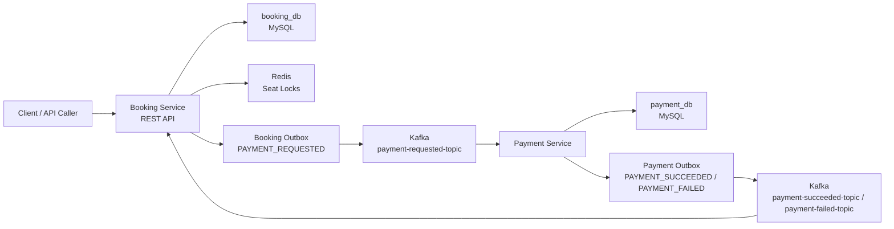

# Reservex Ticket Booking System

Reservex is a Spring Boot microservices project that models a ticket booking flow with seat locking, asynchronous payment processing, Kafka-based communication, and the outbox pattern for reliable event publishing.

The project focuses on the distributed-systems problems that appear in real booking and payment workflows:

- preventing duplicate booking creation
- preventing double seat confirmation
- handling duplicate Kafka events
- preventing duplicate payment rows
- reliably publishing events with an outbox table
- simulating payment success and failure flows
- releasing Redis seat locks after confirmation, cancellation, or expiry

## Architecture



## Services

### common-events

Shared event DTO module used by both services.

Contains events such as:

- `PaymentRequestedEvent`
- `PaymentSucceededEvent`
- `PaymentFailedEvent`
- `BookingCreatedEvent`

Install this module before running the services:

```bash
cd common-events
mvn clean install
```

### booking-service

Runs on port `8081`.

Responsibilities:

- create bookings
- enforce idempotency using `idempotencyKey`
- lock seats in Redis
- reject already-confirmed seats
- initiate payment by creating a `PAYMENT_REQUESTED` outbox event
- publish payment request events to Kafka
- consume payment result events
- confirm seats on payment success
- cancel booking on payment failure
- expire pending bookings

Main endpoints:

```http
POST /bookings
POST /bookings/{bookingId}/pay
```

### payment-service

Runs on port `8082`.

Responsibilities:

- consume `PAYMENT_REQUESTED` events
- prevent duplicate payment creation using `bookingId`
- simulate payment success or failure
- create payment result outbox events
- publish `PAYMENT_SUCCEEDED` or `PAYMENT_FAILED` events to Kafka

Payment result is controlled by:

```yaml
app:
  payment:
    mock-result: SUCCESS
```

Use `FAILED` to test the failure path.

## Infrastructure

The project uses Docker Compose for local infrastructure:

- MySQL 8.4
- Redis 7.2
- Apache Kafka 3.7.1

Start infrastructure:

```bash
docker compose up -d
```

Check containers:

```bash
docker ps
```

The services connect to infrastructure through local ports:

| Component | Local URL |
| --- | --- |
| MySQL | `localhost:3307` |
| Kafka | `localhost:9092` |
| Redis | `localhost:6379` |
| Booking Service | `localhost:8081` |
| Payment Service | `localhost:8082` |

## Database Initialization

MySQL init scripts live in:

```text
mysql-init/init.sql
```

The script creates:

```sql
CREATE DATABASE IF NOT EXISTS booking_db;
CREATE DATABASE IF NOT EXISTS payment_db;
```

Docker Compose mounts this folder into the MySQL container:

```yaml
./mysql-init:/docker-entrypoint-initdb.d
```

MySQL runs scripts from `/docker-entrypoint-initdb.d` only when the database volume is created for the first time.

For an existing local volume, create databases manually if needed:

```bash
docker exec -it reservex-mysql mysql -uroot -proot
```

```sql
CREATE DATABASE IF NOT EXISTS booking_db;
CREATE DATABASE IF NOT EXISTS payment_db;
```

## Kafka Topics

| Topic | Producer | Consumer | Purpose |
| --- | --- | --- | --- |
| `payment-requested-topic` | Booking Service | Payment Service | Request payment for a booking |
| `payment-succeeded-topic` | Payment Service | Booking Service | Confirm booking after successful payment |
| `payment-failed-topic` | Payment Service | Booking Service | Cancel booking after failed payment |

## Outbox Pattern

Both services use an outbox table.

Instead of directly publishing Kafka events inside the business flow, each service first saves an outbox row in the same database transaction as the business state change.

Then a scheduler publishes pending outbox rows to Kafka.

This protects against cases where the database update succeeds but Kafka publishing fails.

Outbox status flow:

```text
PENDING -> PROCESSING -> SENT
                  |
                  -> PENDING / FAILED
```

The outbox publisher first claims an event using an atomic status update:

```text
PENDING -> PROCESSING
```

This prevents multiple service instances from publishing the same outbox event at the same time.

Important note: this is still an at-least-once publishing design. Consumers must remain idempotent.

## Edge Cases Covered

### Duplicate booking request

Booking creation uses an `idempotencyKey`.

If the same request is sent again with the same key, the existing booking is returned instead of creating a duplicate row.

### Concurrent duplicate booking request

The database has a unique constraint on `idempotency_key`.

This protects against race conditions where two requests arrive at the same time.

### Duplicate payment initiation

Payment can only be initiated from a valid booking state.

If payment is already requested, the service returns a safe response instead of creating duplicate payment request events.

### Duplicate `PAYMENT_REQUESTED` Kafka event

Payment Service checks if a payment already exists for the `bookingId`.

The `payments` table also has a unique constraint on `booking_id`.

This prevents duplicate payment rows even if the same Kafka event is delivered multiple times.

### Duplicate payment result event

Booking Service only processes payment result events when the booking is in `PAYMENT_REQUESTED` state.

If a duplicate success or failure event arrives later, the booking is already `CONFIRMED` or `CANCELLED`, so the duplicate event is ignored.

### Double seat confirmation

Confirmed seats are protected with a database unique constraint:

```text
trip_id + seat_number
```

This prevents the same seat from being confirmed twice for the same trip.

### Payment failure

When payment fails:

- payment is marked `FAILED`
- payment failure event is published
- booking is marked `CANCELLED`
- booking seats are marked `CANCELLED`
- Redis locks are released

### Booking expiry

Pending bookings expire after the configured lock TTL.

Expired bookings release their Redis locks.

## Local Setup

### 1. Start infrastructure

```bash
docker compose up -d
```

### 2. Install shared events

```bash
cd common-events
mvn clean install
```

### 3. Run Booking Service

```bash
cd booking-service
mvn spring-boot:run
```

### 4. Run Payment Service

Open another terminal:

```bash
cd payment-service
mvn spring-boot:run
```

## API Usage

### Create booking

```bash
curl -X POST http://localhost:8081/bookings \
  -H "Content-Type: application/json" \
  -d '{
    "userId": 101,
    "tripId": 9001,
    "seatNumbers": ["A1", "A2"],
    "amount": 250.00,
    "idempotencyKey": "booking-9001-user-101"
  }'
```

Example response:

```json
{
  "bookingId": 1,
  "userId": 101,
  "tripId": 9001,
  "seatNumbers": ["A1", "A2"],
  "amount": 250.00,
  "status": "PENDING",
  "expiresAt": "2026-06-08T10:30:00"
}
```

### Initiate payment

```bash
curl -X POST http://localhost:8081/bookings/1/pay
```

Example response:

```json
{
  "bookingId": 1,
  "status": "PAYMENT_REQUESTED",
  "message": "Payment request created successfully"
}
```

After the outbox schedulers run, the booking becomes either:

```text
CONFIRMED
```

or:

```text
CANCELLED
```

depending on the configured payment result.

## Testing

Run common-events build:

```bash
cd common-events
mvn clean install
```

Run Booking Service tests:

```bash
cd booking-service
mvn test
```

Run Payment Service tests:

```bash
cd payment-service
mvn test
```

Payment Service context tests require MySQL and Kafka to be running.

## Verified Scenarios

The following scenarios were manually verified locally:

- booking happy path
- payment success path
- payment failure path
- duplicate booking request
- duplicate `PAYMENT_REQUESTED` event
- duplicate `PAYMENT_SUCCEEDED` event
- already-confirmed seat rejection
- Redis lock release after success
- Redis lock release after failure
- outbox rows reaching `SENT`

## Current Limitations

This project intentionally keeps some production concerns simple.

Known areas for improvement:

- add Testcontainers integration tests
- add Kafka DLQ topics
- add retry backoff with `nextRetryAt`
- add stuck `PROCESSING` outbox recovery
- add Flyway or Liquibase migrations
- add structured API error responses
- add distributed tracing
- add centralized logging and metrics
- add Dockerfiles for each service
- add authentication and authorization

## Tech Stack

- Java 21
- Spring Boot
- Spring Web
- Spring Data JPA
- Spring Kafka
- MySQL
- Redis
- Apache Kafka
- Maven
- Docker Compose
- Lombok
- Actuator

## Project Structure

```text
reservex-ticket-booking-system
|-- booking-service
|-- payment-service
|-- common-events
|-- mysql-init
|   `-- init.sql
|-- docker-compose.yml
`-- README.md
```

## Why This Project Matters

Reservex is not just a CRUD application. It demonstrates how to coordinate state across services without distributed transactions.

The core design uses:

- local database transactions
- idempotent consumers
- unique constraints
- Redis locks
- Kafka events
- outbox publishing

Together, these patterns make the system resilient to common distributed workflow problems such as duplicate requests, duplicate events, and partial failures.
